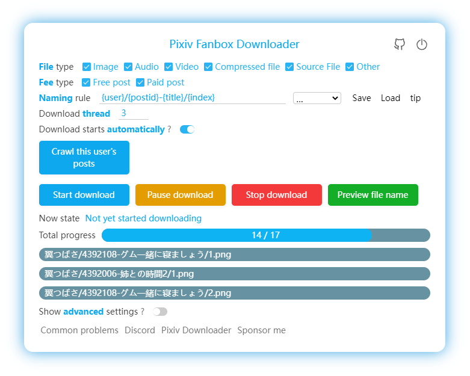

English |
[简体中文](/Readme-ZH-CN.md) | 
[繁體中文](/Readme-ZH-TW.md) |
[日本語](/Readme-JA.md) |
[韩国语](/Readme-KO.md)

<!-- TOC -->

- [Introduction](#introduction)
- [Installation](#installation)
  - [Online Installation](#online-installation)
  - [Offline Installation](#offline-installation)
  - [Using on Android](#using-on-android)
- [How to Use](#how-to-use)
- [Development](#development)
- [Patreon](#patreon)

<!-- /TOC -->

# Introduction

This is a Chrome browser extension for batch downloading files on Pixiv Fanbox.

Supports filtering file types, custom file names, and multiple languages.

**Note:** This program cannot directly unlock paid content on Fanbox. If you want to download paid content, you must first purchase it.



# Installation

We recommend using Chrome or Edge browsers.

## Online Installation

Chromium-based browsers such as Chrome and Edge can install this extension from the **[Chrome Web Store](https://chrome.google.com/webstore/detail/pixiv-fanbox-downloader/ihnfpdchjnmlehnoeffgcbakfmdjcckn)**.

Firefox users can install this extension from the **[Add-Ons](https://addons.mozilla.org/firefox/addon/pixivfanboxdownloader/)** store (it will be available soon).

## Offline Installation

You can refer to the offline installation tutorial for the Pixiv Downloader:
[Offline Installation](https://xuejianxianzun.github.io/PBDWiki/#/en/OfflineInstallation)

There is only one difference: the tutorial above will ask you to download the zip file for the Pixiv Downloader. Instead, download the zip file for the Fanbox Downloader. You can download pixivfanboxDownloader.zip from the [releases page](https://github.com/xuejianxianzun/PixivFanboxDownloader/releases) of this repository.

## Using on Android

On Android, you can install this extension using the Quetta browser. Quetta is a mobile browser with the Chromium core, and you can install extensions online from the Chrome Web Store — very convenient. However, browsers on Android do not create subfolders, so I do not recommend using it on Android.

# How to Use

- After installing this extension, refresh the fanbox page. You will see a blue download button on the right side of the page. Click this button to start using it.
- Downloaded files will be saved in the browser's download directory. If you want to save them to a different location, you need to change the browser's download directory.
- Please disable the browser setting "Ask where to save each file before downloading" to avoid the save-as dialog during downloads.
- If the filename of the downloaded file is abnormal, please disable other browser extensions with download functions.

# Development

Tech stack: This project uses TypeScript, LESS, and Webpack 5.

Development and build commands:

```bash
npm install            # Install dependencies
npm run ts            # Bundle TypeScript with webpack → dist/js/
npm run less          # Compile src/style/style.less to dist/style/style.css with lessc
npm run fmt           # Format with prettier
npm run pre-build     # ts + less + fmt
npm run build         # pre-build + pack.js: updates the contents of /dist and packs them into a zip file
```

You can run the corresponding command depending on what you modified:
- If you only modified ts files: `npm run ts`
- If you only modified less files: `npm run less`
- If you modified other files (e.g. `manifest.json`): run `node pack` to copy the files into the `/dist` directory
- Full build: `npm run build` runs all the commands

In the browser's extension management page, load the `/dist` directory to install this extension locally and debug it. After you modify the source code and compile it into `/dist`, you need to refresh the extension, and then refresh the web page, to apply the changes.

# Patreon

You can support me on patreon. Thank you!

<a href='https://www.patreon.com/xuejianxianzun'></a>