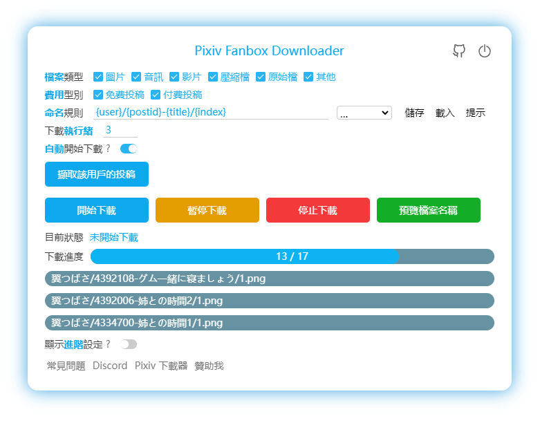

[Discord](https://discord.gg/u4wVMy7xJM)

# 概要

これは、Pixiv Fanbox上のファイルを一括ダウンロードするためのChromeブラウザ拡張機能です。

ファイルタイプのフィルタリング、ファイル名のカスタマイズ、複数の言語に対応しています。

**注意：** このプログラムはFanbox上の有料コンテンツを直接解除することはできません。有料コンテンツをダウンロードするには、まず購入する必要があります。

# インストール

ChromeまたはEdgeブラウザの使用をお勧めします。

## オンラインインストール

Chrome Webストアからこの拡張機能をインストールできます：

[Pixiv Fanbox Downloader](https://chrome.google.com/webstore/detail/pixiv-fanbox-downloader/ihnfpdchjnmlehnoeffgcbakfmdjcckn)

## オフラインインストール

Pixivダウンローダーのオフラインインストールチュートリアルを参照してください：
[オフラインインストール](https://xuejianxianzun.github.io/PBDWiki/#/en/OfflineInstallation)

1点だけ異なる点があります：上記のチュートリアルではPixivダウンローダーのzipファイルをダウンロードするよう指示されていますが、代わりにFanboxダウンローダーのzipファイルをダウンロードしてください。このリポジトリの[releasesページ](https://github.com/xuejianxianzun/PixivFanboxDownloader/releases)からpixivfanboxDownloader.zipをダウンロードできます。

## Androidでの使用

以下のチュートリアルを参照してください：
[Microsoft Edge Canaryブラウザへのインストール](https://xuejianxianzun.github.io/PBDWiki/#/en/MicrosoftEdgeCanary)

1点だけ異なる点があります：上記のチュートリアルではPixivダウンローダーのcrxファイルをダウンロードするよう指示されていますが、代わりにFanboxダウンローダーのcrxファイルをダウンロードしてください。このリポジトリの[releasesページ](https://github.com/xuejianxianzun/PixivFanboxDownloader/releases)からPixiv-Fanbox-Downloader.crxをダウンロードできます。

# 使用方法

- この拡張機能をインストールした後、fanboxページを更新すると、ページの右側に青いダウンロードボタンが表示されます。このボタンをクリックして使用を開始してください。
- ダウンロードしたファイルはブラウザのダウンロードディレクトリに保存されます。別の場所に保存したい場合は、ブラウザのダウンロードディレクトリを変更する必要があります。
- ダウンロード時に「各ファイルの保存場所を尋ねる」ブラウザ設定をオフにしてください。そうしないと、保存先を尋ねるダイアログが表示されます。
- ダウンロードしたファイル名に異常がある場合、ダウンロード機能を持つ他のブラウザ拡張機能を無効にしてください。

# サポートとスポンサー

このツールが役に立ったと感じた場合、サポートやスポンサーをしていただければ幸いです (*╹▽╹*)

Patreon:

