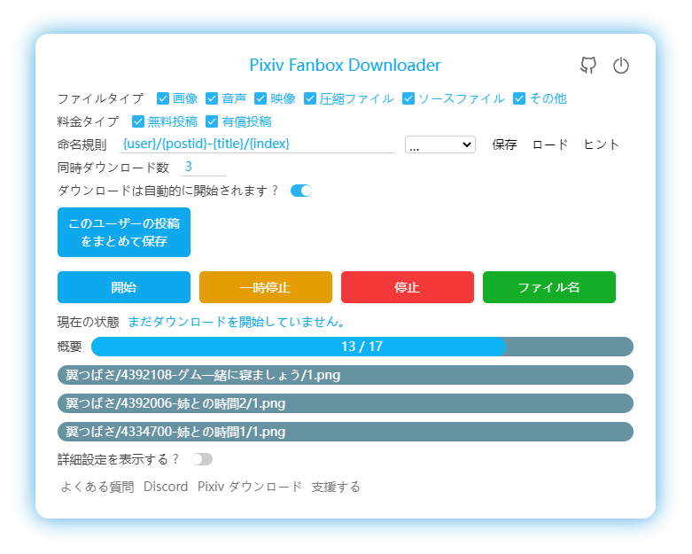

[English](/Readme.md) |
[简体中文](/Readme-ZH-CN.md) | 
[繁體中文](/Readme-ZH-TW.md) |
日本語 |
[韩国语](/Readme-KO.md)

<!-- TOC -->

- [概要](#概要)
- [インストール](#インストール)
  - [オンラインインストール](#オンラインインストール)
  - [オフラインインストール](#オフラインインストール)
  - [Androidでの使用](#androidでの使用)
- [使用方法](#使用方法)
- [開発](#開発)
- [サポートとスポンサー](#サポートとスポンサー)

<!-- /TOC -->

# 概要

これは、Pixiv Fanbox上のファイルを一括ダウンロードするためのChromeブラウザ拡張機能です。

ファイルタイプのフィルタリング、ファイル名のカスタマイズ、複数の言語に対応しています。

**注意：** このプログラムはFanbox上の有料コンテンツを直接解除することはできません。有料コンテンツをダウンロードするには、まず購入する必要があります。



# インストール

ChromeまたはEdgeブラウザの使用をお勧めします。

## オンラインインストール

Chrome、Edge などの Chromium ベースのブラウザでは、**[Chrome Web Store](https://chrome.google.com/webstore/detail/pixiv-fanbox-downloader/ihnfpdchjnmlehnoeffgcbakfmdjcckn)** からこの拡張機能をインストールできます。

Firefox では、**[Add-Ons](https://addons.mozilla.org/firefox/addon/pixivfanboxdownloader/)** からこの拡張機能をインストールできます（近日公開予定）。

## オフラインインストール

Pixivダウンローダーのオフラインインストールチュートリアルを参照してください：
[オフラインインストール](https://xuejianxianzun.github.io/PBDWiki/#/en/OfflineInstallation)

1点だけ異なる点があります：上記のチュートリアルではPixivダウンローダーのzipファイルをダウンロードするよう指示されていますが、代わりにFanboxダウンローダーのzipファイルをダウンロードしてください。このリポジトリの[releasesページ](https://github.com/xuejianxianzun/PixivFanboxDownloader/releases)からpixivfanboxDownloader.zipをダウンロードできます。

## Androidでの使用

Android では、Quetta ブラウザを使用してこの拡張機能をインストールできます。Quetta は Chromium コアのモバイルブラウザで、Chrome Web Store からオンラインで拡張機能をインストールでき、とても便利です。ただし、Android のブラウザではサブフォルダが作成されないため、Android での使用はおすすめしません。

# 使用方法

- この拡張機能をインストールした後、fanboxページを更新すると、ページの右側に青いダウンロードボタンが表示されます。このボタンをクリックして使用を開始してください。
- ダウンロードしたファイルはブラウザのダウンロードディレクトリに保存されます。別の場所に保存したい場合は、ブラウザのダウンロードディレクトリを変更する必要があります。
- ダウンロード時に「各ファイルの保存場所を尋ねる」ブラウザ設定をオフにしてください。そうしないと、保存先を尋ねるダイアログが表示されます。
- ダウンロードしたファイル名に異常がある場合、ダウンロード機能を持つ他のブラウザ拡張機能を無効にしてください。

# 開発

技術スタック：このプロジェクトは TypeScript、LESS、Webpack 5 を使用しています。

開発・ビルドコマンド：

```bash
npm install            # 依存関係のインストール
npm run ts            # webpack で TS をバンドル → dist/js/
npm run less          # lessc で src/style/style.less を dist/style/style.css にコンパイル
npm run fmt           # prettier でフォーマット
npm run pre-build     # ts + less + fmt
npm run build         # pre-build + pack.js：/dist の内容を更新し、zip ファイルにパックする
```

変更内容に応じて、対応するコマンドを実行できます：
- ts ファイルのみを変更した場合：`npm run ts`
- less ファイルのみを変更した場合：`npm run less`
- その他のファイルを変更した場合（例：`manifest.json`）：`node pack` を実行してファイルを `/dist` ディレクトリにコピーします
- 完全なビルド：`npm run build` はすべてのコマンドを実行します

ブラウザの拡張機能管理ページで `/dist` ディレクトリを読み込むと、この拡張機能をローカルにインストールしてデバッグできます。ソースコードを変更して `/dist` にコンパイルした後は、拡張機能を更新してからウェブページを更新して、変更を適用する必要があります。

# サポートとスポンサー

このツールが役に立ったと感じた場合、サポートやスポンサーをしていただければ幸いです (*╹▽╹*)

Patreon:

<a href='https://www.patreon.com/xuejianxianzun'></a>
