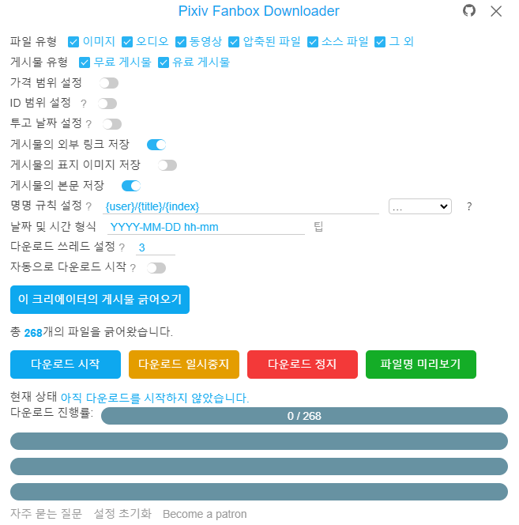

<!-- TOC -->

- [소개](#소개)
- [설치](#설치)
  - [온라인 설치](#온라인-설치)
  - [오프라인 설치](#오프라인-설치)
- [사용하는 방법](#사용하는-방법)
- [Patreon](#patreon)

<!-- /TOC -->

# 소개

이것은 Pixiv Fanbox에서 파일을 일괄 다운로드하기 위한 Chrome 브라우저의 확장 프로그램입니다.

파일 형식 필터링, 사용자 정의 파일명 및 다국어를 지원합니다.

참고: 이 프로그램은 Fanbox의 유료 콘텐츠를 직접 잠금 해제할 수 없습니다. 유료 콘텐츠를 다운로드하려면 먼저 구매해야 합니다.

# 설치

최신 버전의 **Chrome** 브라우저 또는 새로운 **Edge** 브라우저를 사용하는 것이 좋습니다.

## 온라인 설치

이 확장 프로그램은 Chrome 웹 스토어에서 설치할 수 있습니다.

[Chrome 웹 스토어](https://chrome.google.com/webstore/detail/pixiv-fanbox-downloader/ihnfpdchjnmlehnoeffgcbakfmdjcckn)

## 오프라인 설치

만약 당신이 Chrome 웹 스토어에서 이 확장 프로그램을 설치할 수 없는 경우 오프라인으로 설치할 수 있습니다.

1. [Releases](https://github.com/xuejianxianzun/PixivFanboxDownloader/releases)에서 설치 패키지의 최신 버전을 다운로드하고, 디렉토리에 압축을 해제합니다.
2. 확장 프로그램으로 접근합니다. Chrome 브라우저는 메뉴에서 "도구 더보기"-"확장 프로그램"을 클릭하고, Edge 브라우저는 메뉴에서 "확장"을 클릭합니다.
3. 확장 프로그램에서 "개발자 모드"를 활성화합니다.
4. "압축해제된 확장 프로그램을 로드합니다." 버튼을 클릭하고, 설치 패키지가 압축 해제된 디렉토리를 선택합니다.

참고: 오프라인 설치 방법은 자동으로 업데이트되지 않습니다. 업데이트하려면 먼저 이 확장 프로그램을 삭제한 다음 새 버전을 설치해야 합니다.

# 사용하는 방법

- 이 확장 프로그램을 설치한 후 Fanbox 페이지를 새로고침 하면 페이지 오른쪽에 파란색 다운로드 버튼이 나타납니다. 이 버튼을 클릭하여 사용을 시작해주세요.
- 다운로드한 파일은 브라우저의 다운로드 디렉토리에 저장됩니다.
- 다운로드 시 팝업이 표시되지 않도록 브라우저 설정에서 "다운로드 전에 각 파일의 저장 위치 확인" 옵션을 꺼주세요.
- 다운로드 후 파일명이 이상할 경우 다운로드 기능이 있는 다른 브라우저 확장 프로그램을 비활성화해주세요.

# Patreon

Patreon에서 저를 지원할 수 있습니다. 감사합니다!

