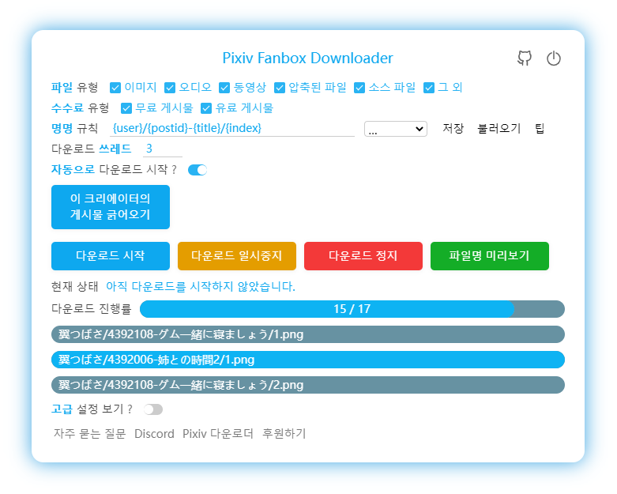

[English](/Readme.md) |
[简体中文](/Readme-ZH-CN.md) | 
[繁體中文](/Readme-ZH-TW.md) |
[日本語](/Readme-JA.md) |
韩国语

<!-- TOC -->

- [소개](#소개)
- [설치](#설치)
  - [온라인 설치](#온라인-설치)
  - [오프라인 설치](#오프라인-설치)
  - [안드로이드에서 사용](#안드로이드에서-사용)
- [사용 방법](#사용-방법)
- [개발](#개발)
- [Patreon](#patreon)

<!-- /TOC -->

# 소개

이것은 Pixiv Fanbox에서 파일을 일괄 다운로드하기 위한 Chrome 브라우저의 확장 프로그램입니다.

파일 형식 필터링, 사용자 정의 파일명 및 다국어를 지원합니다.

**참고:** 이 프로그램은 Fanbox의 유료 콘텐츠를 직접 잠금 해제할 수 없습니다. 유료 콘텐츠를 다운로드하려면 먼저 구매해야 합니다.



# 설치

Chrome 또는 Edge 브라우저를 사용하는 것을 권장합니다.

## 온라인 설치

Chrome, Edge 등 Chromium 기반 브라우저에서는 **[Chrome Web Store](https://chrome.google.com/webstore/detail/pixiv-fanbox-downloader/ihnfpdchjnmlehnoeffgcbakfmdjcckn)** 에서 이 확장 프로그램을 설치할 수 있습니다.

Firefox에서는 **[Add-Ons](https://addons.mozilla.org/firefox/addon/pixivfanboxdownloader/)** 에서 이 확장 프로그램을 설치할 수 있습니다 (곧 출시 예정).

## 오프라인 설치

Pixiv 다운로더의 오프라인 설치 튜토리얼을 참고할 수 있습니다:
[오프라인 설치](https://xuejianxianzun.github.io/PBDWiki/#/en/OfflineInstallation)

한 가지 차이점만 있습니다: 위 튜토리얼에서는 Pixiv 다운로더의 zip 파일을 다운로드하라고 안내하지만, 대신 Fanbox 다운로더의 zip 파일을 다운로드하면 됩니다. 이 저장소의 [releases 페이지](https://github.com/xuejianxianzun/PixivFanboxDownloader/releases)에서 pixivfanboxDownloader.zip을 다운로드할 수 있습니다.

## 안드로이드에서 사용

Android에서는 Quetta 브라우저를 사용하여 이 확장 프로그램을 설치할 수 있습니다. Quetta는 Chromium 코어 기반의 모바일 브라우저로, Chrome Web Store에서 온라인으로 확장 프로그램을 설치할 수 있어 매우 편리합니다. 다만 Android 브라우저는 하위 폴더를 만들지 않으므로 Android에서의 사용은 권장하지 않습니다.

# 사용 방법

- 이 확장 프로그램을 설치한 후 fanbox 페이지를 새로고침하면 페이지 오른쪽에 파란색 다운로드 버튼이 표시됩니다. 이 버튼을 클릭하여 사용을 시작하세요.
- 다운로드한 파일은 브라우저의 다운로드 디렉토리에 저장됩니다. 다른 위치에 저장하려면 브라우저의 다운로드 디렉토리를 변경해야 합니다.
- 다운로드 시 "각 파일을 저장할 위치를 물어보기" 브라우저 설정을 비활성화하여 저장 위치를 묻는 창이 나타나지 않도록 하세요.
- 다운로드한 파일 이름이 비정상적인 경우, 다운로드 기능을 가진 다른 브라우저 확장 프로그램을 비활성화하세요.

# 개발

기술 스택: 이 프로젝트는 TypeScript, LESS, Webpack 5를 사용합니다.

개발 및 빌드 명령어:

```bash
npm install            # 의존성 설치
npm run ts            # webpack으로 TS 번들 → dist/js/
npm run less          # lessc로 src/style/style.less를 dist/style/style.css로 컴파일
npm run fmt           # prettier로 포맷팅
npm run pre-build     # ts + less + fmt
npm run build         # pre-build + pack.js: /dist 내용을 업데이트하고 zip 파일로 패킹
```

수정한 내용에 따라 해당 명령어를 실행하면 됩니다:
- ts 파일만 수정한 경우: `npm run ts`
- less 파일만 수정한 경우: `npm run less`
- 다른 파일을 수정한 경우(예: `manifest.json`): `node pack`을 실행하여 파일을 `/dist` 디렉토리로 복사합니다
- 전체 빌드: `npm run build`는 모든 명령어를 실행합니다

브라우저의 확장 프로그램 관리 페이지에서 `/dist` 디렉토리를 로드하면 이 확장 프로그램을 로컬에 설치하고 디버그할 수 있습니다. 소스 코드를 수정하고 `/dist`로 컴파일한 후에는 확장 프로그램을 새로고침한 다음 웹 페이지를 새로고침하여 변경 사항을 적용해야 합니다.

# Patreon

Patreon에서 저를 지원할 수 있습니다. 감사합니다!

<a href='https://www.patreon.com/xuejianxianzun'></a>