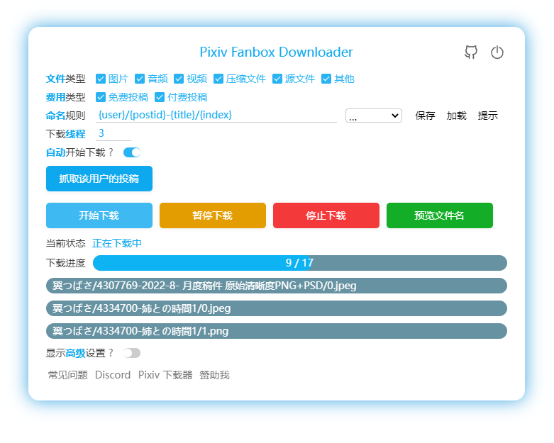

[English](/Readme.md) |
简体中文 | 
[繁體中文](/Readme-ZH-TW.md) |
[日本語](/Readme-JA.md) |
[韩国语](/Readme-KO.md)

<!-- TOC -->

- [简介](#简介)
- [安装](#安装)
  - [在线安装](#在线安装)
  - [离线安装](#离线安装)
  - [在 Android 上使用](#在-android-上使用)
- [如何使用](#如何使用)
- [开发](#开发)
- [支持和捐助](#支持和捐助)

<!-- /TOC -->

# 简介

这是一个 Chrome 浏览器扩展程序，用于批量下载 Pixiv Fanbox 上的文件。

支持过滤文件类型、自定义文件名，支持多种语言。

**注意：** 本程序并不能直接解锁 Fanbox 上的付费内容。如果你想要下载付费内容，必须先购买它。



# 安装

推荐使用 Chrome 或者 Edge 浏览器。

## 在线安装

Chrome、Edge 等 Chromium 内核的浏览器可以从 **[Chrome Web Store](https://chrome.google.com/webstore/detail/pixiv-fanbox-downloader/ihnfpdchjnmlehnoeffgcbakfmdjcckn)** 安装本扩展。

Firefox 浏览器可以从 **[Add-Ons](https://addons.mozilla.org/firefox/addon/pixivfanboxdownloader/)** 安装本扩展（将于近期发布）。

## 离线安装

你可以参考 Pixiv 下载器的离线安装教程：
[离线安装](https://xuejianxianzun.github.io/PBDWiki/#/zh-cn/%E7%A6%BB%E7%BA%BF%E5%AE%89%E8%A3%85)

只有一点不同：上面的教程里会让你下载 Pixiv 下载器的 zip 文件，改为 Fanbox 下载器的 zip 文件即可。你可以本仓库的 [releases 页面](https://github.com/xuejianxianzun/PixivFanboxDownloader/releases) 里下载 pixivfanboxDownloader.zip。

## 在 Android 上使用

在 Android 系统上，你可以使用 Quetta 浏览器安装这个扩展。Quetta 是一个 Chromium 内核的移动端浏览器，可以从 Chrome Web Store 在线安装扩展程序，非常方便。但是 Android 上的浏览器不会创建子文件夹，所以我不推荐在 Android 上使用。

# 如何使用

- 安装这个扩展程序之后，刷新 fanbox 页面，在页面右侧可以看到蓝色的下载按钮，点击这个按钮开始使用。
- 下载的文件会保存在浏览器的下载目录里。如果你想保存到其他位置，需要修改浏览器的下载目录。
- 请关闭浏览器设置中的“下载前询问每个文件的保存位置”选项，以免在下载时出现另存为窗口。
- 如果下载后的文件名异常，请禁用其他有下载功能的浏览器扩展。
- 如有其他问题或建议，欢迎加 QQ 群 853021998 进行交流。

# 开发

技术栈：本项目使用 TypeScript、LESS、Webpack 5。

开发与构建命令：

```bash
npm install            # 安装依赖
npm run ts            # webpack 打包 TS → dist/js/
npm run less          # lessc 编译 src/style/style.less → dist/style/style.css
npm run fmt           # prettier 格式化
npm run pre-build     # ts + less + fmt
npm run build         # pre-build + pack.js，这会更新 /dist 里的内容，并打包为 zip 文件
```

你可以根据修改的内容执行对应的命令：
- 只修改了 ts 文件时：`npm run ts`
- 只修改了 less 文件时：`npm run less`
- 修改了其他文件时（如 `manifest.json`）：执行 `node pack` 将文件复制到 `/dist` 目录里
- 完整构建：`npm run build` 会执行所有命令

在浏览器的扩展管理页面里，加载 `/dist` 目录即可本地安装这个扩展，并进行调试。当你修改源代码，并编译到 `/dist` 里之后，需要刷新本扩展，然后刷新网页，以应用更改。

# 支持和捐助

如果您感觉本脚本帮到了您，您可以对我进行支持和捐助，不胜感激 (*╹▽╹*)

1. 爱发电：

[https://afdian.com/a/xuejianxianzun](https://afdian.com/a/xuejianxianzun)

2. Patreon：

[https://www.patreon.com/xuejianxianzun](https://www.patreon.com/xuejianxianzun)

3. 你可以通过微信或支付宝扫码转账：

 
