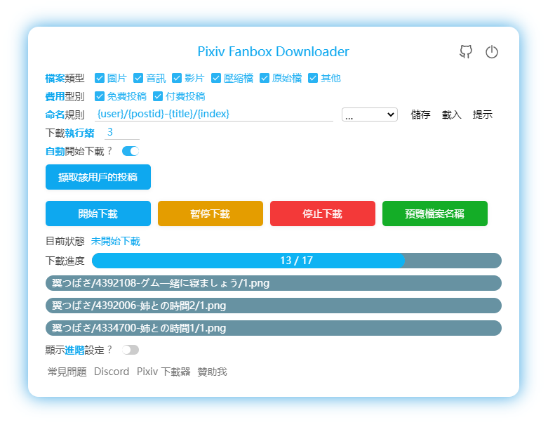

[English](/README.md) |
[简体中文](/README-ZH-CN.md) | 
繁體中文 |
[日本語](/README-JA.md) |
[韩国语](/README-KO.md)

<!-- TOC -->

- [簡介](#簡介)
- [安裝](#安裝)
  - [在線安裝](#在線安裝)
  - [離線安裝](#離線安裝)
  - [在 Android 上使用](#在-android-上使用)
- [如何使用](#如何使用)
- [開發](#開發)
- [支持和贊助](#支持和贊助)

<!-- /TOC -->

# 簡介

這是一個 Chrome 瀏覽器擴充功能，用於批次下載 Pixiv Fanbox 上的檔案。

支援過濾檔案類型、自訂檔名，支援多種語言。

**注意：** 本程式並不能直接解鎖 Fanbox 上的付費內容。如果你想要下載付費內容，必須先購買它。



# 安裝

推薦使用 Chrome 或 Edge 瀏覽器。

## 在線安裝

Chrome、Edge 等 Chromium 核心的瀏覽器可以從 **[Chrome Web Store](https://chrome.google.com/webstore/detail/pixiv-fanbox-downloader/ihnfpdchjnmlehnoeffgcbakfmdjcckn)** 安裝本擴充功能。

Firefox 瀏覽器可以從 **[Add-Ons](https://addons.mozilla.org/firefox/addon/pixivfanboxdownloader/)** 安裝本擴充功能（即將發布）。

## 離線安裝

您可以參考 Pixiv 下載器的離線安裝教程：
[離線安裝](https://xuejianxianzun.github.io/PBDWiki/#/zh-tw/%E7%A6%BB%E7%B7%9A%E5%AE%89%E8%A3%9D)

只有一點不同：上述教程中會要求您下載 Pixiv 下載器的 zip 文件，請改為下載 Fanbox 下載器的 zip 文件即可。您可以在本倉庫的 [releases 頁面](https://github.com/xuejianxianzun/PixivFanboxDownloader/releases) 下載 pixivfanboxDownloader.zip。

## 在 Android 上使用

在 Android 系統上，你可以使用 Quetta 瀏覽器安裝這個擴充功能。Quetta 是一個 Chromium 內核的行動端瀏覽器，可以從 Chrome Web Store 線上安裝擴充功能，非常方便。但是 Android 上的瀏覽器不會建立子資料夾，所以我不推薦在 Android 上使用。

# 如何使用

- 安裝此擴展程式後，重新整理 fanbox 頁面，在頁面右側可以看到藍色的下載按鈕，點擊此按鈕即可開始使用。
- 下載的文件將保存在瀏覽器的下載目錄中。如果您想保存到其他位置，需要修改瀏覽器的下載目錄。
- 請關閉瀏覽器設置中的「下載前詢問每個文件的保存位置」選項，以免在下載時出現另存為窗口。
- 若下載後的文件名異常，請禁用其他具有下載功能的瀏覽器擴展。

# 開發

技術棧：本專案使用 TypeScript、LESS、Webpack 5。

開發與建置命令：

```bash
npm install            # 安裝依賴
npm run ts            # webpack 打包 TS → dist/js/
npm run less          # lessc 編譯 src/style/style.less → dist/style/style.css
npm run fmt           # prettier 格式化
npm run pre-build     # ts + less + fmt
npm run build         # pre-build + pack.js，這會更新 /dist 裡的內容，並打包為 zip 檔案
```

你可以根據修改的內容執行對應的命令：
- 只修改了 ts 檔案時：`npm run ts`
- 只修改了 less 檔案時：`npm run less`
- 修改了其他檔案時（如 `manifest.json`）：執行 `node pack` 將檔案複製到 `/dist` 目錄裡
- 完整建置：`npm run build` 會執行所有命令

在瀏覽器的擴充功能管理頁面裡，載入 `/dist` 目錄即可在本機安裝這個擴充功能，並進行除錯。當你修改原始碼，並編譯到 `/dist` 裡之後，需要重新整理本擴充功能，然後重新整理網頁，以套用更改。

# 支持和贊助

如果您感覺本工具幫到了您，您可以支持和贊助我，不勝感激 (*╹▽╹*)

Patreon:

<a href='https://www.patreon.com/xuejianxianzun'></a>
