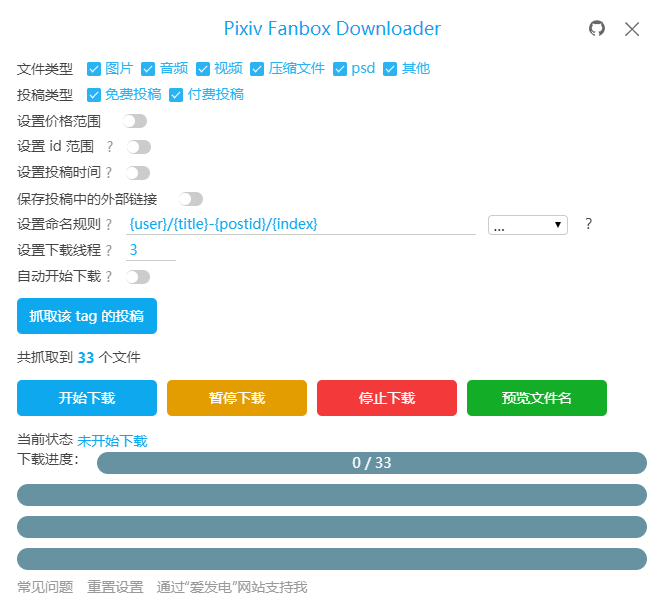

<!-- TOC -->

- [简介](#简介)
- [安装](#安装)
  - [在线安装](#在线安装)
  - [离线安装](#离线安装)
- [如何使用](#如何使用)
- [支持和捐助](#支持和捐助)

<!-- /TOC -->

[View English introduction](Readme-EN.md)

[查看繁体中文介绍](Readme-ZH-TW.md)

[한국어 소개 보기](Readme-KO.md)

# 简介

这是一个 Chrome 浏览器扩展程序，用于批量下载 Pixiv Fanbox 上的文件。

支持过滤文件类型、自定义文件名，支持多种语言。

注意：本程序并不能直接解锁 Fanbox 上的付费内容。如果你想要下载付费内容，必须先购买它。

QQ 群：853021998

# 安装

推荐使用 Chrome 浏览器最新版，或者新版 Edge 浏览器。

## 在线安装

您可以从 Chrome Web Store 安装本扩展。

[Chrome Web Store 页面](https://chrome.google.com/webstore/detail/pixiv-fanbox-downloader/ihnfpdchjnmlehnoeffgcbakfmdjcckn)

## 离线安装

如果您无法从 Chrome Web Store 安装本扩展，您可以离线安装。

1. 进入扩展程序管理。Chrome 点击菜单的“更多工具” - “扩展管理”；Edge 点击菜单的 “扩展”。
2. 如果你之前已经安装了这个扩展，就先停止它，或者删除它。
3. 下载最新版本的安装包，并解压出来，里面是一个文件夹。你可以从 [release 页面](https://github.com/xuejianxianzun/PixivFanboxDownloader/releases) 下载安装包。
4. 在扩展管理页面，启用“开发者模式"。
5. 点击按钮 “加载已解压的扩展程序”，选择刚才解压得到的文件夹。
6. 你应该已经成功的离线安装了这个扩展程序。
7. 如果你此时已经有打开的 fanbox.cc 的页面，需要刷新它们，这样才能让它们使用扩展程序的新版本。你也可以直接重启浏览器。

注意：使用离线安装方式，不会自动更新。当你想要更新时，需要先删除这个扩展，然后安装新版本。

# 如何使用

- 安装这个扩展程序之后，刷新 fanbox 页面，在页面右侧可以看到蓝色的下载按钮，点击这个按钮开始使用。
- 下载的文件会保存在浏览器的下载目录里。
- 请关闭浏览器设置中的“下载前询问每个文件的保存位置”选项，以免在下载时出现弹窗。
- 如果下载后的文件名异常，请禁用其他有下载功能的浏览器扩展。
- 如果使用 ssr、v2ray 等工具，下载时开启“全局代理”以提高下载速度。
- 如有其他问题或建议，欢迎加 QQ 群 853021998 进行交流。

# 支持和捐助

如果您感觉本工具帮到了您，您可以对我进行支持和捐助，不胜感激 (*╹▽╹*)

1. 国内的众筹赞助平台“爱发电”（类似于 patreon）。

[https://afdian.net/@xuejianxianzun](https://afdian.net/@xuejianxianzun)

2. 可通过微信和支付宝扫码转账

 