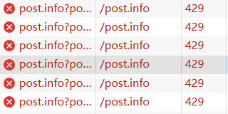
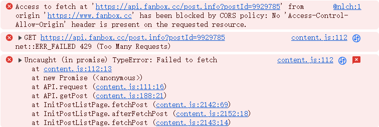
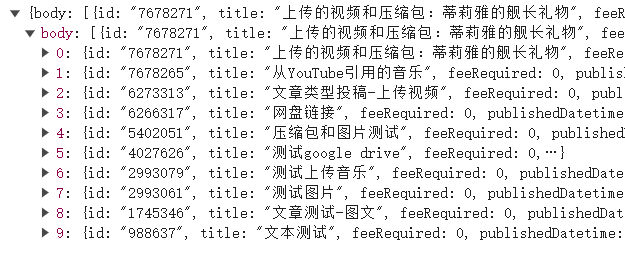
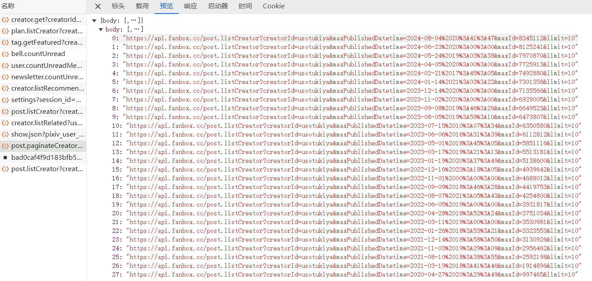
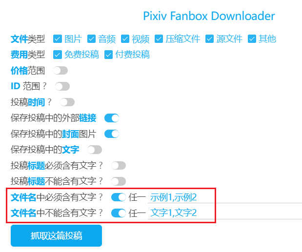

export NODE_OPTIONS=--openssl-legacy-provider

添加俄语

# 4.7.0 2025/08/03

这个版本增加了一些设置，用于减慢抓取和下载速度，降低封号的可能性。

最近 Fanbox 的限制变得更严格了，有几个用户向我反馈，说他们的账号被封禁了，原因是爬虫类程序过度爬取。

其中一个用户在前两天一共下载了 50 GB, 今天下载了 17 GB（花了一个小时半的时间），之后就被封号了。

### ✨新增设置：抓取间隔

抓取投稿时，每个请求之间的间隔时间，单位是秒。

这是为了降低下载器发送请求的频率（特别是大量抓取时），从而减少账号被封的可能性。

你可以修改此设置，最小值是 0（即无限制）。

### ✨新增设置：下载间隔

每隔一定时间开始一次下载，单位是秒。

默认值为 1，即每小时最多会从 Fanbox 下载 3600 个文件。

这是为了降低从 Fanbox 下载文件的频率（特别是下载体积较小的图片时），从而减少账号被封的可能性。

你可以修改此设置，最小值是 0（即无限制）。

### ✨新增设置：每天下载的文件大小限制

每当下载完一个文件之后，下载器都会检查今天下载的文件的总体积。如果达到了限制，下载器会自动暂停下载。

此功能是为了避免下载过多的文件，导致账号被封禁。

说明：
1. “今天”指自然天，而非最近 24 小时。
2. 下载器只会统计下载成功的文件的体积。

### 🚀升级依赖项到最新版

所有依赖项的版本都更新了。建议开发人员删除旧的 node_modules 文件夹，重新执行 `npm i` 安装依赖。

# 4.6.2 2025/07/30

### 当文件名异常时，不保存其下载记录，以便用户可以再次下载它

之前当文件名异常时（例如变成 UUID 格式），下载器依然会保存它的下载记录，这导致了问题：用户在禁用了导致此问题的扩展之后，可能想要重新下载这个文件，但此时会因为“不下载重复文件”而导致这个文件被跳过（除非关闭“不下载重复文件”功能）。

现在下载器在文件名异常时，不会保存其下载记录了。

技术细节：即使文件名异常，下载器保存的下载记录里的文件名依然是正常的，因为保存下载记录时，文件名是下载器生成的正常的文件名。

# 4.6.1 2025/07/26

### 📝优化了文件名异常的提示

最近 IDM Integration Module 扩展更新后，会导致下载器的文件名异常。由于安装了 IDM 扩展的用户非常多，所以此问题集中爆发了，很多人都问我，我疲于应付。现在我添加了更详细的说明，让用户知道问题的原因，以及应该怎么处理。

### 日志数量较多时，拆分成多个日志区域

之前当日志数量超过上限时，下载器会直接删除所有日志。现在这些日志都会被保留，新的日志会在新的日志区域里显示。

# 4.6.0 2025/07/25

### 🕒增加了请求之间的延迟，通过减慢抓取速度避免 429 限制

之前下载器在抓取文章时，同时有 6 个抓取线程，并且没有延迟。

现在改成同时只抓取 1 个，并且每个请求之间延迟 1 秒钟。

我测试抓取了逆流茶会的 528 个投稿和 omutatsu 的 184 个投稿，都顺利的抓取完了，中间没有出错。

https://www.fanbox.cc/@nlch

https://www.fanbox.cc/@omrice4869

以防万一，如果依然遇到错误，下载器会等待 6 分钟再继续抓取。

#### 错误表现

最近下载器的许多用户都遇到了抓取卡住的问题。原因就是 fanbox 增加了限制，在下载器之前的高速抓取时，只发送了 37 个请求左右就会被限制。此时会触发 429 限制，而且是 Cloudflare 直接拒绝了请求，并不是 fanbox 的服务器返回的 429 状态码，所以还会有个 CORS 错误：






因为下载器没有针对此错误进行处理，所以会因为错误卡住。

#### 测试情况

我设置单线程抓取，但不添加延迟时间，抓取表现如下：

- 请求了 33 个文章信息，出错
- 3 分钟后重试，直接出错
- 3 分钟后重试，可以抓取，这次抓取了 30 个文章信息后再次出错
- 之后重复上面两个步骤

也就是出错后，3 分钟的等待时间不够，需要 6 分钟。

在 6 分钟后重试，每次可以固定抓取 30 个文章，之后就会被再次限制。

### 同时下载数量的最大值从 6 减小到 3

近期有些用户因为下载的文件较多被封号了。我先减小同时下载数量，以后再完善下。

在下载大量小图片时，如果同时下载数量很多，对服务器文件的下载请求会很频繁。这种异常的高速率可能会增加封号的风险。

# 4.5.0 2025/01/20

### ✨新功能：抓取关注的所有用户的投稿

你可以在 Fanbox 主页和关注的创作者页面里使用此功能。

-----------

提示：关注的用户里不会有赞助的用户。

当你赞助一个用户时，会自动关注他，但是他不会在关注的用户里，而是在赞助的用户里。

取消赞助后，他会出现在关注的用户里。

-----------

测试大量抓取会不会被封号：

我有 10 个关注的用户，他们的全部投稿有 1506 个。我全抓了一遍，很快完成了（因为抓取投稿数据时没有间隔）。

3 点 11 分抓取完成。

14 个小时后，账号依然正常，没有被警告或封禁。

--------

设置过滤条件以减少不必要的抓取：

当我设置了只抓取“免费投稿”时，有 208 个投稿，数量是不加限制时的七分之一。

之后再加上只抓取今年发布的投稿，就只有 9 个投稿了。

### 🐛修复了保存正文时，没有保存“标题”格式的文字的问题

正文里的文字可以设置为“标题”格式，它使用了一个独立的标记 `type : 'header'`。

我之前没注意到这个情况，导致下载器在保存正文文本时，不会保存“标题”格式的文字。

现在修复了此问题。

测试用的文章：https://www.fanbox.cc/@xuejianxianzun/posts/9201637

### 保存外链时会显示提示

当抓取结果里有外链保存到 TXT 文件时，会显示一条提示消息：

这次的抓取结果里有一些外部链接，下载器会把它们保存到 TXT 文件里，请手动处理。

# 4.4.2 2024/09/02

### 🐛修复抓取到 vimeo.com 插入的视频时，输出网址错误的问题

对于这样的数据：

```json
"video": {
  "serviceProvider": "vimeo",
  "videoId": "968618271"
}
```

下载器应该输出这样的链接：https://player.vimeo.com/video/968618271

之前输出的链接是错误的，因为网址前缀不正确。现在修复此问题。

# 4.4.1 2024/08/23

### ✨“价格范围”现在可以设置为等于指定价格了

“价格范围”现在可以设置为等于（=）指定价格了。以前只能设置为大于等于（>=）。

# 4.4.0 2024/08/06

### 🐛修复因为 API 数据变化导致抓取失败的问题

在用户主页抓取时（也就是说在文章列表页面时），用的 API 是 `/post.listCreator?creatorId=usotukiya&limit=300` 这样。之前文章列表数据保存在 `data.body.items` 里，现在直接是 `data.body` 了。

之前返回的数据结构：

```ts
body: {
  items: PostListItem[]
  nextUrl: null | string
}
```

现在只有：

```ts
body: PostListItem[]
```




`PostListItem[]` 直接提升到 body 里，另外取消了 nextUrl。

之前的 nextUrl 是用于获取下一批作品数据的 URL，但现在没有了。那怎么请求后续文章呢？其实看下官方怎么做的就知道了，有个分页 API `/post.paginateCreator?creatorId=creatorId` 会返回一个网址列表，里面就是用于获取每一个列表页数据的 URL（每次显示 10 个）。



之前下载器没有使用这个 API，因为获取文章列表数据时，有前面说的 nextUrl 可以用。而且之前一页可以获取 300 条文章数据。300 是最大数字，超出的话 API 会报错。

考虑到极端情况，假设某个作者有 1000 篇文章，那么下载器现在只能请求到第一批的 300 个（因为没有 nextUrl 了），会漏掉后续的文章。

现在我有 2 个解决思路：

1. 使用官方的分页 API 获取每一个列表页的 URL，但是它每个 URL 里只有 10 篇文章，需要对列表页发起 100 次请求。
2. 先使用官方的分页 API，然后我自行修改一下，实现每 300 页发起一次请求。

用 2 的方式比较好，现在采用了 2 的方式。

**注意：** 并非所有的请求列表数据的 API 都发生了变化。只有在用户主页抓取文章列表出现了变化。

在 fanbox 主页“抓取赞助的所有用户的投稿”的数据没有变化。

在文章 tag 列表页抓取的数据也没有变化。

### 跳过文章时，日志里的文章标题添加了对应的超链接

例如：

```
跳过 66 HINA 因为：价格限制 1000
```

现在文章标题“66 HINA”会添加文章的超链接，可以点击它打开文章页面。

目前只有跳过文章会显示日志；跳过文章内的文件时不会显示日志。

# 4.3.0 2024/03/29

### 新功能：文件名中必须/不能含有文字

现在你可以通过文件名来过滤文件了。

此处的文件指作者上传的附件，通常是压缩包、视频、音频，它们会在网页上显示文件名。



Fanbox 的文章根据撰写前选择的类型，有如下分类：


其中压缩包、视频等作者自行上传的附件只在两种类型里有，就是“文章”和“文件”，作品类型分别为 article 和 file。


# 4.2.6 2024/01/22

### 因为价格限制不能抓取文章时，显示具体价格

之前下载器的日志里没有显示具体价格，现在会显示，例如：

```
跳过 xxxx 因为：价格限制 1000
```

### 修复了保存投稿文字时，换行不正确的问题

现在换行的效果可以保持与原文一致。

# 4.2.5 2023/09/24

### 优化了对 SERVER_FAILED 错误的提示和重试机制

https://github.com/xuejianxianzun/PixivFanboxDownloader/issues/51

这个文章的封面图是 500 错误：

https://www.fanbox.cc/@chisamell/posts/4368124

SERVER_FAILED 错误是 500 服务器内部错误。下载器会尝试进行重试，但是有些文件没有缩略图，无法重试，会无限循环。

现在下载器优化了提示，并且当文件没有缩略图时，跳过下载它。

# 4.2.4 2023/07/01

### 支持了 fanbox 新增的一种嵌入网址类型，可以提取其 URL

fanbox 现在把一些网盘外链转换成 `html.card` 类型，这是新出现的一个类型，导致下载器提取不到其 URL，现在修复。

具体可以查看 `docs\保存网盘链接的问题.md`。

# 4.2.3 2023/06/30

### 修复了预览文件名的结果保存为 txt 时，内容是 html 格式的问题

当预览内容太多（大于 5000 条）时，下载器会把输出内容保存到一个 txt 文件里，但是里面却依然是 html 代码。

现在把 txt 的内容改为纯文本。

https://github.com/xuejianxianzun/PixivFanboxDownloader/issues/49

# 4.2.2 2023/06/28

### 把机场链接从 xfx 替换为农家有风小院

# 4.2.1 2023/06/07

### 替换了常见问题里的机场链接

之前的 ttk 机场网址不能用了，已经 20 天了，我现在才想起来把它换掉。

# 4.2.0 2023/03/14

### 新增设置：非图片的命名规则

现在你可以为图片文件和非图片文件设置独立的命名规则。

另外，非图片文件的默认名字改为它们的原文件名，而不是序号。

也就是压缩包等文件的默认名字从 `{index}` 变成 `{name}`。

### 非法文件名的问题

之前 Pixiv 下载器因为有些用户名是 `con.fundo_` 这样的，含有 `con.`，这可能会造成无效的文件名。

但是 Fanbox 的创作者 ID 可使用小写的半角英文数字与连字符，输入 `.` 是非法的，所以不会有这个问题。

# 4.1.1 2022/12/27

### 修复 bug：Services Worker 被回收导致的下载异常

昨天有个用户反馈问题：

```
昨天發現當下載大檔案時(200MB 約十分鐘)，下載完成後下載器不會繼續下載下一個檔案，狀態則停留在"正在下載"。
按下暫停下載後再按下開始下載，會將同個檔案重複再下載一次。
如果是像圖片的小檔案則下載器運作正常。
```

这个大文件下载了大约 10 分钟，而本下载器的文件下载是由浏览器去下载的（而非下载器下载完成之后交给浏览器），所以问题的原因可能是在浏览器下载期间，Services Worker 被回收导致 `dlData` 变量被清空，导致文件下载完成后，后台找不到对应的数据，也就不会告诉前台下载已完成。

现在我把 `dlData` 做了持久化存储，以期解决此问题。不过我没有大文件和很低网速的情况来进行测试。理论上是没问题的。

# 4.1.0 2022/12/25

### 移除了 declarativeNetRequest 权限

以前下载器需要给发出的请求设置 origin 和 referer 标头，所以需要修改网络请求的权限。

现在我试了下不需要修改请求也能正常使用了，所以移除了 declarativeNetRequest 权限。

# 4.0.0 2022/12/25

### 升级到 Manifest V3

### 修复 bug：修复了恢复未完成的下载时，进度条没有显示已下载数量的问题

# 3.3.0 2022/11/23

### 新增命名标记 {create_id}

`{create_id}` 画师的创作者 ID（英文名或罗马字）。

其实就是 URL 里显示的用户的英文名，如 `https://www.fanbox.cc/@tsubasachyan` 里的 `tsubasachyan`。

### 修改了一些命名标记的名字

- `{postid}` 改为 `{post_id}`
- `{uid}` 改为 `{user_id}`

这样修改是为了显得更加合理，之前的标记名字有些太随意了。

不过旧的标记依旧可以使用，所以用户不必去修改自己以前使用的命名规则。

### 修改了默认的命名规则和时间格式

默认的命名规则改为 `{user}/{date}-{title}/{index}`。

默认的时间格式现在只有年月日，不带小时和分钟。如果有需要，可以在“日期和时间格式”里进行修改。

# 3.2.1 2022/11/14

### 用户取消下载时，不再重试下载

如果用户手动取消了下载（错误代码 `USER_CANCELED`），下载器不会再重试下载这个文件。

### 在 Yandex 浏览器显示提示消息，建议切换到 kiwi 浏览器

### IDM 下载 fanbox 文件的情况

下载 fanbox 的文件需要 cookie（封面图除外），所以直接把文件 URL 复制到 IDM 是无法下载的（403）。

但是当在浏览器里下载完一个文件时，或者下载时转发到 IDM，则 IDM 可以下载这个文件。原理尚不清楚。

# 3.2.0 2022/09/19

### 新增设置

- 投稿标题不能含有关键字
- 投稿标题必须含有关键字

用户可以根据投稿标题来筛选要抓取的投稿了。

### 即使遇到价格限制，也可以保存封面图

以前如果一个投稿遇到了价格限制，下载器不会抓取它的封面图。现在可以了。

### 修复 bug

修复了“ID 范围”设置不显示的问题。

### 优化提示

### 抓取完毕后，按照 postid 排序抓取结果

这样在下载时，文件的下载顺序就是按照投稿发表时间下载的。

# 3.1.1 2022/09/14

### 新增提示：因为价格限制，无法抓取投稿

当某个投稿因为价格限制无法抓取时，下载器会在日志显示此提示。

当抓取完成后，下载器会显示遇到价格限制的投稿的总数。

# 3.1.0 2022/09/10

### 修复了用户未登录时，页面一直跳转的问题

下载器默认会把网址改成用户名在后的形式，然而当用户未登录时，fanbox 会强制把网址改为用户名在前的形式，这造成了冲突。

现在下载器会判断用户是否登录，未登录时不会修改网址。

### 在底部添加了 Discord 频道

# 3.0.0 2022/09/10

### 代码重构

Fanbox 下载器是从我的 Pixiv 下载器修改而来的，但是 Pixiv 下载器的代码不断优化，而 Fanbox 下载器的代码依然停留在两年多之前的时候。这导致 Fanbox 下载器的代码修改和维护起来很麻烦，添加新功能也不方便。所以现在我决定参考 Pixiv 下载器现在的代码对其进行重构。

### 添加新功能

新增了如下设置：

- 恢复未完成的下载任务
- 在序号前面填充 0
- 下载完成后显示通知
- 不下载重复文件
- 高亮显示关键字
- 背景图片
- Language
- 管理设置
- 显示高级设置
- 统一网址格式

### 优化了提示和用户体验

### 修复一些问题

之前不同用户页面里的设置可能是不通用的。现在可以通用了。

### 统一网址格式的说明：

Fanbox 有两套网址形式：

1. https://r-kitada.fanbox.cc/
2. https://www.fanbox.cc/@r-kitada

上面同一个用户的两个网址，但由于子域名不同，所以浏览器认为是不同的网站。

受此影响，这两种网址里的下载记录数据和背景图片是不通用的。

如果启用“统一网址格式”，下载器总是会使用第二种网址，这样数据就可以通用了。

# 2.0.1 2022/07/17

### 优化韩语翻译

https://github.com/xuejianxianzun/PixivFanboxDownloader/pull/37

# 2.0.0 2022/07/13

### 添加了韩语文本

感谢 KOZ39 添加的韩语翻译！

https://github.com/xuejianxianzun/PixivFanboxDownloader/pull/35

# 1.9.6 2022/07/10

### 修复 bug

修复了 `urlEmbedMap` 类型的外链会无视“保存投稿中的外部链接”设置，始终保存的问题。

# 1.9.5 2022/06/24

### 修复 bug

https://www.fanbox.cc/@singlecask/posts/4012918

这篇文章里的 `urlEmbedMap` 字段类型之前没见过，导致了抓取出错，现在修复。

目前对于 `"type": "fanbox.post"` 的内容不进行处理和保存。

# 1.9.4 2022/06/23

### 支持保存嵌入的 url

文章类型投稿不知何时增加了 `urlEmbedMap` 字段，它可以把插入的 url 地址直接转换成卡片或者内嵌的 html 代码。

现在下载器支持提取此类链接。

https://github.com/xuejianxianzun/PixivFanboxDownloader/issues/31

# 1.9.3 2022/06/02

### 文件 404 时不再重试下载它

Chrome 浏览器下载一个文件时，如果返回了错误代码 `SERVER_BAD_CONTENT` 就说明是 404 错误，文件不存在。

之前下载器没有检测这个错误，会一直重试下载。现在对于 404 错误不会再重试下载。

### 修复抓取 entry 类型投稿时可能出现的其他错误

上个版本修复的方式不彻底，某些情况下仍会出问题，例如：

https://nekoworks.fanbox.cc/posts/935

里面有个图片的代码是这样的：

```html
<a href="https://downloads.fanbox.cc/images/post/935/2s2e082blxescogs0wo4g4oo.png"></a>
```

问题在于图片后缀是 jpeg，但是超链接后缀是 png。这个情况很少见。

之前下载器取 entry 类型投稿时提取的是图片 src，但是在这种情况中就会出错。

现在改为提取 a 标签的 href，解决此类错误。

# 1.9.2 2022/06/02

### 修复了一些早期投稿中下载的图片不是原图的问题

https://github.com/xuejianxianzun/PixivFanboxDownloader/issues/28

在早期的一些 entry 类型的投稿里，图片的网址是缩略图，不是原图，现在对此进行了修复。

PS：现在似乎没有 entry 类型了。

# 1.9.1 2022/03/11

### 修复了文章中可能下载到空的 txt 文件的问题

如果用户启用了“保存投稿中的文字”的功能，之前下载器可能会保存空的 txt 文件。

这是因为有的投稿里的空字符串也被保存了。现在修复了这个问题。

测试投稿：https://xuejianxianzun.fanbox.cc/posts/2993061

# 1.9.0 2022/03/11

### 修复了在画师主页抓取时出现错误的问题

因为 Fanbox API 的变化，在画师主页抓取时，返回的数据变了，没有 type 字段，也缺少了文章里的附件、多媒体资源，导致抓取出错。

现在修复了，先获取作品 id 列表，然后逐个作品进行抓取。但是这样抓取花的时间比以前要多很多。

相关 issues: https://github.com/xuejianxianzun/PixivFanboxDownloader/issues/23

# 1.8.1 2021/07/18

### 修复下载原图时因为 500 错误而导致無限重试的問題

[issues 16](https://github.com/xuejianxianzun/PixivFanboxDownloader/issues/16)

Fanbox 中有些图片无法以原图打开，图片会回传一个 status 500 的 response 而内容是 `failed to thumbnailing`。

现在下载文件失败时，如果 Chrome 返回的错误代码是 `SERVER_FAILED`，则把这个文件的 URL 从 originalUrl 改为 thumbnailUrl 进行重试。

出现此问题的页面网址： https://takuya-yoshimura.fanbox.cc/posts/1237796

---------

Fanbox 官方对此问题的回复：

```
谢谢你的兴趣。
我们是pixivFANBOX办公室。

请注意，pixivFANBOX不允许上传高度和宽度都大于16,000px的图片。
就你发给我们的网页而言，你所提交的图片有可能超过上述尺寸。
如果你想查看更大的尺寸，请联系创作者。
```

据此推测，可能无法下载的几张图片是宽高都太大了。如果改为上传文件的方式或许就好了。

# 1.8.0 2021/03/29

### 修复下载卡住无法重试的问题

当下载卡住时，主要有两种可能的原因：

1. 网络错误 `NETWORK_FAILED`
2. 用户取消 `USER_CANCELED`

这些错误可以被下载器捕获到，下载器会重试下载。只需要等待下载器自动重试即可，不需要手动暂停，然后再开始。

之前版本在重试时存在问题，导致重试机制失效，现在已经修复了，可以正常重试下载。

之前导致重试失效的原因：后台脚本会保存要下载的文件的数据，包括 id。当下载失败之后，下载器向后台脚本发送重试请求，但是因为这个文件的 id 已经保存过，后台脚本不会再下载它。现在去掉了对重复 id 的检测，所以可以进行重试了。

# 1.7.1 2021/01/04

### 修复了重置设置无效的 bug

# 1.7.0 2021/01/04

### 新增设置项：保存投稿中的封面图片

这个选项默认未开启。

开启之后，如果投稿里有封面图片，就会下载。

封面图片的序号 `{index}` 总是 `0`。

### 优化了文件类型的提示效果

### 修复了某些文章可能下载到空的 txt 文件的问题

主要是投稿类型为 image 的文章，可能正文文本是个空字符串。以前没有判断这里，导致可能会下载到空的 txt 文件。现在修复。

# 1.6.0 2021/01/01

### 对下载途中卡住的问题进行了一定的优化

以前下载器下载时，即使网络没有发生异常，也可能会卡住。

现在优化了一些，网络正常的话应该不会卡住了。

>但是因为网络出现异常导致下载中断的情况，还是会卡住。

以前导致异常的原因推测是：一些文件在下载时使用的 id 可能会重复。现在修复了此问题。

### 对停止任务后重新开始下载进行了优化

以前如果暂停或者停止下载，然后点“开始下载”，有些文件会提示下载失败。失败的都是下载器生成的 txt 文件。

现在进行了优化，不会出现这个错误了。

原因是下载器自己生成的 txt 是 blob url，下载一次之后释放了了 blob url。现在不再释放，就可以重复下载了。

>其他文件都是 fanbox 的 url，直接交给浏览器预去下载的。

### 其他优化

`background.ts` 里修改网络请求头的时候，进行了优化，只对 `api.fanbox.cc` 网址的请求修改其请求头，不会再出现下面的报错信息了：

```Invalid header specification '{"name":"Origin"}'.```

### 说明：同名文件会加序号，而不是覆盖

同名文件指的是处于一个文件夹里并且完全同名的文件，如 `user` 文件夹里有两个 `a.jpg`，它们就是同名文件。处于不同文件夹里，或者文件后缀名不同的，不是同名文件。

现在，浏览器在下载到同名文件时，会**自动在后面加序号，而不是覆盖**。

有的用户可能希望覆盖同名文件，主要场景是：以前对一个用户进行了抓取，现在再次抓取，把以前下载过的文件又下载了一遍，被重复下载的文件可能是同名文件。同名文件的后面加上了序号，需要搜索出来进行删除。如果用新文件覆盖掉旧文件，就比较方便。

经过我和一些群友的讨论，发现有些时候不能使用覆盖的方式，否则会导致意料之外的情况。所以现在下载器依然保持着让浏览器添加序号的方式。

不能使用覆盖的场景如：

- fanbox 允许一个文章里有同名文件，例如画师可以在一篇投稿里上传 2 个名为 `a.zip` 的附件。如果覆盖就可能会导致只有一个文件被保存，这是错误的。
- 某个画师发布的两篇投稿，它们的标题、投稿时间、附件名字完全一致。在大多数情况下，这将产生同名文件。如果覆盖就会导致最后只保存了一篇投稿里的文件。

以上情况都有实例。用户并不能预知何时会产生同名文件，下载器也不能预知。（下载器虽然可以检查本次下载的文件名，但是并不能检查硬盘上的文件，所以不能妥善处理同名文件的情况）。下载器为了能处理上面的特殊情况，目前只能让浏览器自动给同名文件加序号。

# 1.5.0 2020/12/31

### 优化了文件名重复时的处理

以前文件名重复时，下载器会在重复文件的后面添加一串随机字符。这种处理方式不太好，现在进行了优化。

现在不会给重名的文件添加特殊符号，而是由浏览器处理，如果有重复的文件，浏览器会自动在后面添加序号。

# 1.4.1 2020/12/30

### 可以抓取 Google Froms 的嵌入链接了

Fanbox 文章的嵌入来源里有个 Google Froms，但由于没有见到画师使用，所以之前对它是有一些猜测的成分的，导致不能正确提取它的链接。现在进行修复。

附一个 Google Froms：

https://docs.google.com/forms/d/e/1FAIpQLSe6yLe2XKQnVH221WLffUeRJUpx1NALNGqkdcddWsh4tSMesw/viewform

# 1.4.0 2020/12/24

### 投稿日期设置改为日期范围

之前日期设置只能输入一个日期，然后设置大于、小于。

现在改为设置日期范围。

可以实现和之前相同的功能，还能设置一段时间范围。

# 1.3.1 2020/10/27

### 固定一个随机字符串的长度

如果命名规则里使用了 `{name}`，但是 `{name}` 产生了重复，那么下载器会在 `{name}` 后面添加一些随机字符。

之前这个随机字符的长度并不固定，所以现在将其调整到固定为 8 个字符。

# 1.3.0 2020/10/22

### 添加 {task_date} 命名标记

本次任务抓取完成时的时间。例如：2020-10-21

### 可以设置日期和时间的格式

增加了日期和时间格式的设置项。

# 1.2.5 2020/10/16

### 优化繁体中文文本

https://github.com/xuejianxianzun/PixivFanboxDownloader/pull/4

感谢 VHlqg 提交的繁体中文优化，以及 readme。

# 1.2.4 2020/10/06

### 加大下载线程数量限制

以前最大只能有 3 个同时下载线程，现在允许最大到 10 个。

之所以之前的限制只有 3 个，是因为同时下载多个大文件的话，可能一些文件下载完但是进度条没有变化，下载就卡住了。现在应一些用户的要求加大了下载线程，但是出现这个情况的几率也会增加，希望他们不要来找我问为什么。

# 1.2.3 2020/08/03

### 修复 bug

热心群友（滑稽）报告了一些抓取出错的情况，经过排查，是投稿数据里 body 里的资源数量和资源 map 里的数量不一致导致的。比如 https://sakichisuzu.fanbox.cc/posts/1123079 body 里显示应该有3个图片，但实际上 imageMap 里只有2个图片，导致出错。另外其他画师的投稿还有 file 对不上的类似情况。现在做了判断，进行修复。

# 1.2.2 2020/07/29

### 处理了投稿类型为 entry 的情况

[issues 3](https://github.com/xuejianxianzun/PixivFanboxDownloader/issues/3) 报告早期一些作品抓取出错，一看确实，早期有种投稿类型是“entry”，它的所有内容都保存在一整段 html 里，存放在 `body.html` 字段。现在对这个问题进行了修复。

# 1.2.0 2020/07/24

### 添加了保存文章正文的选项

保存投稿中的文字

如果启用这个选项，那么文章的正文会和文章里的 url 保存到同一个 txt 文件里下载。

# 1.1.2 2020/07/03

### 优化了文件类型的分类

psd 和 clip 都归属于“源文件”了。

鼠标放到文件类型上，会显示包含的后缀名。

### 修复了一些 bug

#### 同名文件下载只下载了一个的问题

如果一篇文章里多个文件的原文件名相同，如 https://countryside.fanbox.cc/posts/968477 有一个 zip 和一个 pdf 的文件名都是“shokumusu_c94_r18”，导致了程序内部出现错误，只下载了同名的第一个文件。现在进行修复。

#### 文本里的链接抓取不全的问题

同一个段落里有多个链接的，如 https://kirastar3626.fanbox.cc/posts/1116141 ，之前只抓取到第一个。现在做出优化，可以都抓取到了。

# 1.1.1 2020/05/25

### 找到了 Twitter 的前缀

`https://twitter.com/i/web/status/` 加上推文的 id 

# 1.1.0 2020/04/28

### 适应 url 改版

fanbox 域名从 `www.pixiv.net/fanbox` 迁移到了独立域名 `fanbox.cc`，对此进行了适配。

#### 已知问题

1. 配置不能充分共享。

因为 fanbox.cc 的域名前缀可能是用户名，例如 `user1.fanbox.cc`  和 `user2.fanbox.cc` 就是跨域的了，所以如果在 user1 里修改了设置条件，但在其他用户页面里是读取不到的，读取不到就会使用默认设置。所以这点比较坑。还好一般人不会赞助太多的用户，每个用户自己改一遍设置吧。

2. 设置 Origin 时发生错误

有时候扩展会发生错误：

`Unchecked runtime.lastError: Invalid header specification '{"name":"Origin"}'.`

background 会对没有 Origin 的请求设置 Origin，fanbox 本身的一些请求可能会导致抛出这个错误，但扩展发起的请求不会出现这个错误。

这个错误目前似乎对使用没有影响，也不会导致 fanbox 自身的请求失败，先不管了。

#### 待观察

去掉了 manifest.json 里的 `"*://*.pximg.net/*"`，因为 fanbox.cc 里用户的文件似乎都是 `downloads.fanbox.cc`的，没有再使用 `pximg.net` 了，所以去掉。

话说 fanbox 下载器是把 url 交给浏览器下载的，所以实际上也不用在意文件的 url 了。

#### 一点技术细节

从 www.fanbox.cc 或者以用户名为前缀的 any.fanbox.cc 去请求 api.fanbox.cc 的 url，请求失败。

扩展在前台脚本里发送出的 fetch 请求，没有 `referer` 也没有 `origin`。这好像有点奇怪。

我在 background 里设置 `requestHeaders`，把 `referer` 和 `origin` 都设置成 www.fanbox.cc，控制台看着是添加上了，但是实际上请求仍然失败。

搜索了好久，原来 chrome 79 开始，扩展修改的请求头如果不符合标准（我理解的是像 `origin` 这样本来不应该修改的请求头），会先向服务器发起 CORS 预检查， response headers  里有 `access-control-allow-headers` 和 `access-control-allow-origin`，可能浏览器是根据这些信息来判断的，如果我们的跨域请求被拒绝了，那么我们的这个请求，包括自己修改的 header 就不会被发出去。

如果要欺瞒 CORS 检查，需要添加 `extraHeaders` 才行。这个标记以前不知道。

相关文档：

https://developer.chrome.com/extensions/webRequest

搜索 extraHeaders 查看这部分说明。

##### 更坑的地方

当扩展添加 `referer` 和 `origin`  请求头的时候，实际上使用的是 `details.initiator`。这是因为这两个请求头都必须和发起请求的页面的网址前缀相同：

如果发起请求的页面的网址前缀是 www ，也就是 `www.fanbox.cc` 开头的，那么 `referer` 和 `origin` 设置成 `https://www.fanbox.cc` 就行。

但是如果发起页的网址前缀不是 www（如果用户自定义了用户名，那么 www 就会变成用户名，如 `https://kyomoneko.fanbox.cc`），这时候服务器可能检测了一些条件，要求 `referer` 和 `origin` 必须符合这个用户名，也就是需要 `https://kyomoneko.fanbox.cc` 才行。此时如果设置成  `https://www.fanbox.cc` 那么请求不会报错，但也不会返回任何数据。

# 修改 logo 2020/04/20

今天看到谷歌商店拒绝了这个扩展，说是虚假宣传之类的。我去掉了 logo 上的文字，再试试。

结果：仍然没有通过审核。

# 1.0.2 2020/04/24

### 优化提取文本中的链接

1. 解决了不能抓取 mega 网盘链接的问题。

之前的正则表达式没有涵盖网址里的一些特殊字符，导致匹配出错，现在修复。

目前的正则是：

```/http[s]*:\/\/[\w=\?\.\/&\-\#\!\%]+/g```

2. 之前在段落包含 links 字段时没有保存里面的链接，现在加以保存。

### 去除了代码中多余的导入

# 1.0.1 2020/04/17

### 修复已知问题

某些 Article 类型的投稿里，图片在文章里的顺序，与图片在附件数据里的顺序不一致。之前是按照附件数据来存储数据，导致顺序错误，应该以文章里的顺序为准。现在修复了这个问题。

示例投稿：
https://www.pixiv.net/fanbox/creator/236592/post/954377

# 1.0.0 2020/04/15

正式发布

### 已知问题

如果因为某些异常导致下载卡住，那么暂停、再开始下载，没有反应

下载的问题，大批量下载可能到最后一两个卡住

---------

## 测试页面

我的主页：

https://xuejianxianzun.fanbox.cc/

这个画师的免费投稿比较多：

https://hmzz.fanbox.cc/

这个画师有一些免费的大图：

https://www.fanbox.cc/@itsuwa0815

--------------

[omutatsu/おむたつ](https://www.pixiv.net/fanbox/creator/1499614)

有 100 和 500 两档赞助，并且都有对应价格的资源

有对所有人公开的投稿

有图片

有 psd

-没有视频
-没有 zip

--------------

测试抓取 tag（标签分类）用：

https://www.fanbox.cc/@sakichisuzu/tags/%E3%82%AA%E3%83%8A%E3%83%8B%E3%83%BC

--------------

[さき千鈴](https://www.pixiv.net/fanbox/creator/236592/post)

测试视频用

## 下载时的错误代码

### SERVER_BAD_CONTENT

下载文件时可能遇到 SERVER_BAD_CONTENT 错误：

```
https://downloads.fanbox.cc/images/post/935/2s2e082blxescogs0wo4g4oo.jpeg Download error! Code: SERVER_BAD_CONTENT. Will try again later.
```

SERVER_BAD_CONTENT 就是 404 错误。请求的文件不存在。
