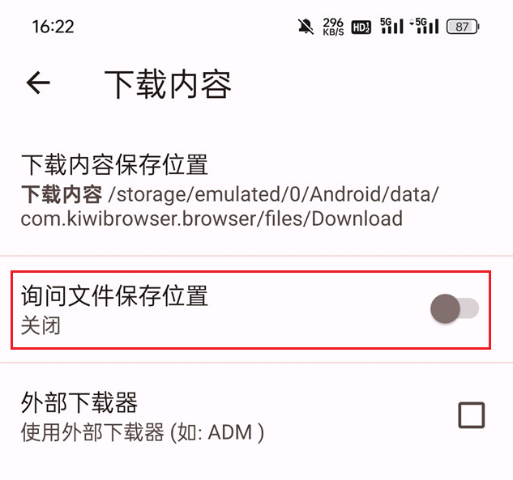
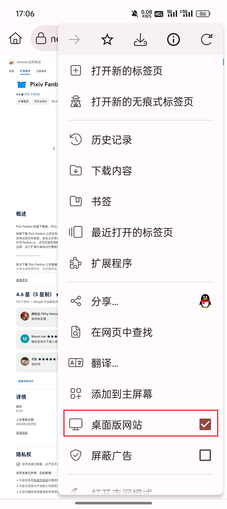
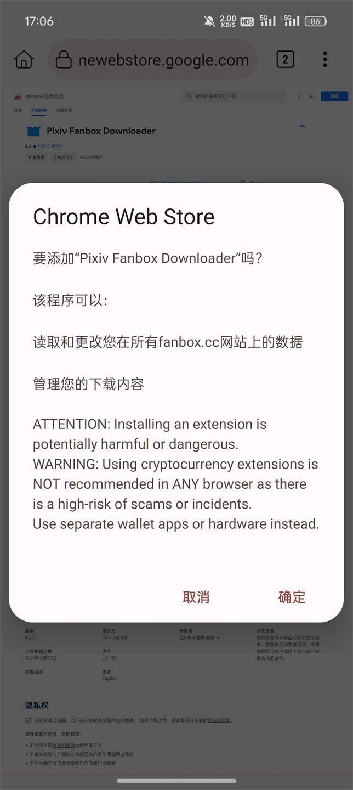
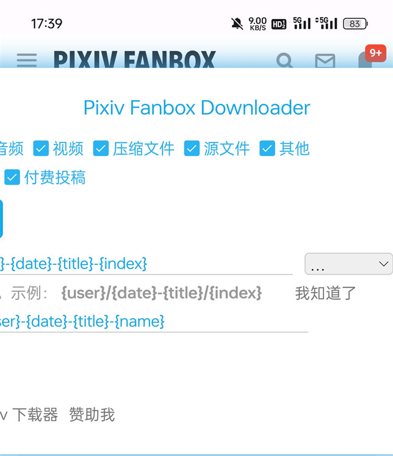
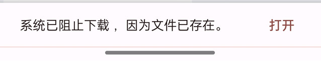

安卓上的很多浏览器都不支持安装扩展程序，所以如果你想在安卓上使用这个下载器，需要使用可以安装扩展程序的浏览器。

Kiwi 浏览器就是其中的一个。虽然它存在一些问题，不过目前还没有比它更好的浏览器（在使用此扩展的意义上）。

使用方法如下：

### 1. 安装 Kiwi 浏览器

请从 Google play 里安装 Kiwi 浏览器。


[Kiwi 浏览器的 Google Play 页面](https://play.google.com/store/apps/details?id=com.Kiwibrowser.browser&hl=en&gl=US)

### 2. 确认浏览器设置

从浏览器的菜单进入“设置”-“下载内容”，确认“询问文件保存位置”是关闭的：



另外它还需要使用存储（文件）权限。通常来说，当 Kiwi 浏览器第一次下载文件时，它应该会主动请求存储权限。如果你没有看到这个请求，请到安卓系统的设置里，允许它使用存储权限。

### 3. 安装本扩展程序

使用 Kiwi 浏览器打开本扩展程序的安装页面：

[本扩展的 Chrome Web Store 安装页面](https://chromewebstore.google.com/detail/pixiv-fanbox-downloader/ihnfpdchjnmlehnoeffgcbakfmdjcckn)

打开该页面后，右上角应该会显示一个蓝色的安装按钮。如果你看不到这个按钮，请打开 Kiwi 浏览器的菜单，选择“桌面版网站”。这会把网页以 PC 端浏览器的效果显示出来。



之后点击右上角的安装按钮，并确认安装。



稍等一会儿，等待扩展安装成功即可。

### 4. 在 Fanbox 上使用

打开 fanbox 网站，并登录你的账号。

如果你已经打开了 fanbox 的页面，需要刷新页面才能使用下载器。

在安装扩展之后，你应该可以在页面右侧看到一个或两个蓝色的按钮，这是下载器的按钮：


第一个按钮可以打开下载器的面板。但是此时你看到的面板可能只显示了一部分：



如果遇到这个问题，请在 Kiwi 浏览器的设置里选择“桌面版网站”，即可解决。之后下载器的面板应该可以完整显示了。


之后，你还需要修改下载器的命名规则，也就是下载的文件名。原因后面讲。

点击“图片的命名规则”右侧的输入框，将里面的斜线 `/` 改为其他字符，比如横线 `-`。

```
{user}/{date}-{title}/{index}
改为：
{user}-{date}-{title}-{index}
```

然后点击“非图片的命名规则”右侧的输入框，依然将斜线 `/` 改为横线 `-`。

```
{user}/{date}-{title}/{name}
改为：
{user}-{date}-{title}-{name}
```

这样就设置好了，之后就可以点击蓝色的抓取按钮开始使用了。

#### 为什么要修改命名规则呢？

如果你在 PC 上使用是不需要修改的，但是 Kiwi 浏览器则不同，因为它有个 bug，它在下载时不会创建文件夹，所有文件都直接保存在下载目录里。这可能会因为一些文件名重复导致无法下载。

例如原本下载器会保存 `文章1/1.jpg` 和 `文章2/1.jpg`，由于 Kiwi 浏览器不会创建文件夹，这就会导致下载目录里存在两个 `1.jpg`。第一个文件可以下载，第二个则因为文件名重复，会被 Kiwi 浏览器阻止下载。你会看到这样的提示：



所以上面修改命名规则的目的就是确保每个文件的文件名不重复。

#### 如何清除 Kiwi 浏览器的下载记录

前面已经说过，如果 Kiwi 浏览器认为一个文件已经存在，就不会保存同名文件。如果你有需要，可以在必要的时候清除它的下载记录。

有两种方式可以清除 Kiwi 浏览器的下载记录。第一种方法是在它的下载管理里操作，选择所有文件然后点击删除按钮。

但是当文件数量很多时，这样操作会很慢。

第二种方法是在文件管理器里进入下载目录，然后选择所有文件并将其彻底删除。


注意需要彻底删除。有时你的文件管理器可能只是将文件移动到了回收站，此时文件其实依然是存在的，Kiwi 浏览器也依然知道这些文件是存在的（下载过的）。所以需要将文件彻底删除才能让 Kiwi 浏览器里的下载记录也失效。
